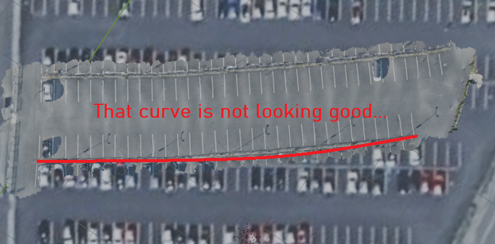

# AR Dev Blog Post 2
**Authors:** Simon Lassen, Anders Hellesøe

## Finishing up the preparation for the 3D model
In [AR Dev Blog Post 1](../AR%20Dev%20Blog%20Post%201/README.md), we made the preparation of the 3D model by scanning the VIA Parking lot with a 3D scanner app.
With that done, it was time to get started on the actual 3D model that should be used within our Unity app.

The 3D scans were imported into blender. Upon closer inspection, we realized that the 3D scans themselves actually weren't very accurate.
When overlaying the picture of the parking lot from Google maps on top of our 3D models, it appeared that our scans were curved.



We realized that the 3D scans weren't very helpful as they simply lacked accuracy, and that it perhaps might be better to just use the Google Maps image.

So now the plan was to just use the Google maps image instead. We needed a real-life measurement to scale the image to the correct size. We planned to measure one side of the parking lot, and then scale the image to match that measurement.
We asked "kort- og landmålingsuddannelsen" if we could borrow some measuring equipment to measure the one side of the parking lot.
While that wasn't possible, teacher Jesper Møller Koudal was intrigued by our project.
He offered to ask some students from his class to measure the entire parking lot for us.

Long story short, we ended up receiving [this PDF document](media/P-Plads.pdf) from him and his students with the exact measurements of the parking lot.
Their measurements were far more precise than anything we could have achieved on our own.
With that, we could now create a very accurate 3D model of the VIA parking area.
The process of how we created the 3D model is described further in [AR Dev Blog Post 3](../AR%20Dev%20Blog%20Post%203/README.md)

## The Unity AR Application
While working on creating the 3D model on the side, we also worked on creating our AR application.

Our AR application is made in Unity with AR Foundation. The program makes use of various managers and some scripts. 
We wanted to be able to look at a sign and then spawn the parking spot anchored on that sign, for this we make use of a `ARTrackedImageManager` to scan the sign.
We define a list of images that contain a image of the sign. We can then scan the sign and have a listener do something once the sign is found.


For initial testing we used a board game to make it easier to work on the project while being home.
Once the image is seen the manager will spawn an object over top of were the image was detected and will transform the spawned object to match the images location and rotation. An events will also be fired with information about what is tracked. By listening to the event that get fired, we can spawn an object and set its parent as the object spawned by the manager.

```cs
public class ParkingAreaSpawner : MonoBehaviour
{
    [SerializeField] ARTrackedImageManager m_TrackedImageManager;
    [SerializeField] GameObject parckingAreaPrefab;

    void OnEnable() => m_TrackedImageManager.trackablesChanged.AddListener(OnChanged);

    private void OnChanged(ARTrackablesChangedEventArgs<ARTrackedImage> eventArgs)
    {
        if (m_TrackedImageManager.trackables.count > 0 && eventArgs.added.FirstOrDefault()?.transform.childCount == 0)
        {
            var theParckingArea = Instantiate(parckingAreaPrefab);
            theParckingArea.transform.SetParent(eventArgs.added.FirstOrDefault()?.transform, false);
        }
    }
}

```

When the script is triggered by the event firing, it instantiates a prefab and sets its parent as the object added from the manager.

Once the representation of the parking lot is spawn we want to be able to show the location of specific parking spots. For this we had 2 ideas of how we wanted to do this. We wanted to have at least 1 object spawn at the spot, and we wanted another object to points towards the spot.

```cs
public class ParkingSpaceFinder : MonoBehaviour
{
    [SerializeField] private Vector3[] parkingSpots;
    [SerializeField] private GameObject marker;
    // Start is called once before the first execution of Update after the MonoBehaviour is created
    void Start()
    {
        var obj = GameObject.Find("ParkingSpaceInput");
        if (obj != null) {
            obj.GetComponent<TMP_InputField>().onValueChanged.AddListener(SearchForParkingSpace);
        }
    }

    void SearchForParkingSpace(string parkingSpace)
    {
        if (int.TryParse(parkingSpace, out int number))
        {
            if (number <= parkingSpots.Length && number > 0)
            {
                marker.SetActive(true);
                marker.transform.localPosition = parkingSpots[number-1];
            } else {
                marker.SetActive(false);
            }
        } else {
            marker.SetActive(false);
        }
    }
}
```

The script looks at a input field and once that changes the a marker object is placed at the position of the parking spot, as specified in a vector3 array. The marker is hidden if no parking space is input.

```cs
public class packingSpacePointerController : MonoBehaviour
{

    [SerializeField] GameObject XROrigin;
    [SerializeField] GameObject pointer;
    private GameObject parckingArea;
    // Start is called once before the first execution of Update after the MonoBehaviour is created
    void Start()
    {
        var obj = GameObject.Find("ParkingSpaceInput");
        if (obj != null) {
            obj.GetComponent<TMP_InputField>().onValueChanged.AddListener(SearchForParkingSpace);
        }
    }

    private void SearchForParkingSpace(string arg0) {
        StartCoroutine(GetCylinder());
    }

    private IEnumerator GetCylinder() {
        yield return new WaitForEndOfFrame();
        parckingArea = XROrigin.GetNamedChild("Cylinder");
    }

    // Update is called once per frame
    void Update()
    {
        if (parckingArea != null && parckingArea.activeSelf) {
            pointer.SetActive(true);
            pointer.transform.LookAt(parckingArea.transform.position);
        } else {
            pointer.SetActive(false);
        }
    }
}
```

The pointer script finds the marker object and then points the pointer towards in while it exists and is active.