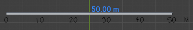
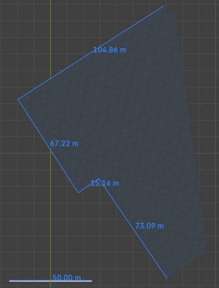
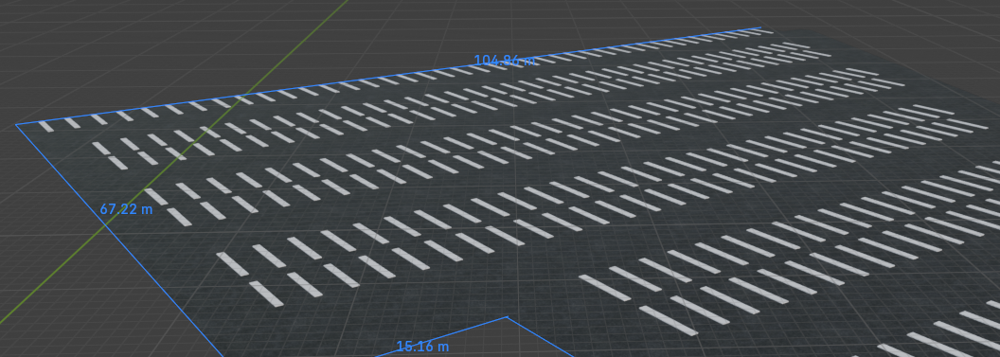
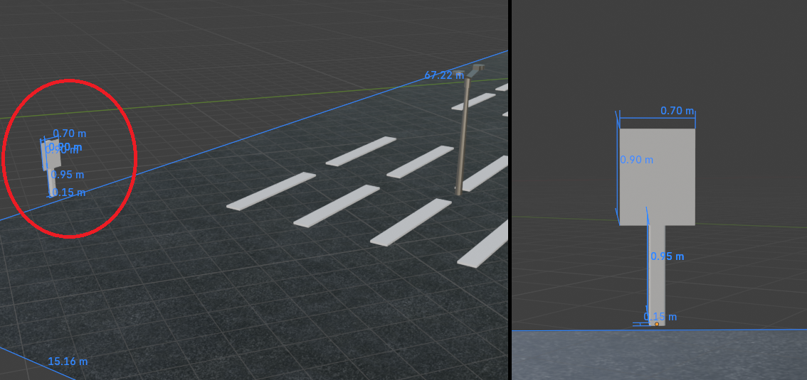
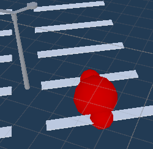
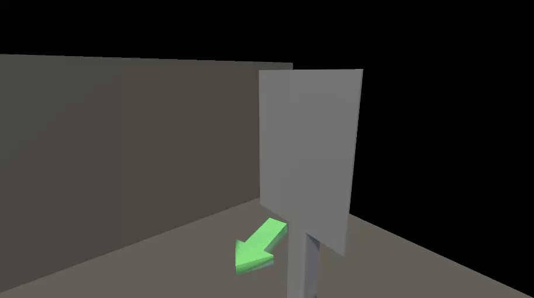

# AR Dev Blog Post 3
**Authors:** Simon Lassen, Anders Hellesøe

## Creating the 3D model of the VIA Parking Lot
After receiving an illustration with exact measurements of the VIA parking lot (explained in [AR Dev Blog Post 2](../AR%20Dev%20Blog%20Post%202/README.md)), we were ready to start modelling.

The illustration created by "kort- og landmålingsuddannelsen" was in vector graphics format.
After some file conversion, it was possible to import these vectors into Blender.
We used a plugin called MeasureIt in Blender, which made it possible to measure distances between vertices. The 50 meter scale provided on the parking lot illustration was scaled to match 50 meters in Blender.



From there, it was possible to model the parking lot plane in the correct scale.



Every single parking spot had to be modelled into our 3D model. This process was quite tedious, but the end result looked like this:



The last thing needed on the 3D model was the calibration sign that the Unity application will use to figure out where to place the 3D model when overlaying it on top of the real world. We measured the sign ourselves and placed it accordingly in the 3D model:



And with that, our 3D model was finished. The model was imported into Unity to finish up our AR application.

## Aligning and Utilizing the 3D Model

With the 3D model fully finished a few newer problems were created, mainly alignment with the world and pointing to a specific space.

Alignment was slightly troublesome, as a quite high degree of "flatness" was needed, and the main part of the model would be behind the user/camera during scanning.
The anchor point of the model is as mentioned the sign, and as such the entire model is anchored at it's edge. Being anchored at the edge, means that slight tilts in one direction can create big differences at the other end of something the scale of a parking lot.

```cs
    Quaternion.Euler(new Vector3(((1f/3f)*100f)+1f,-90,-90));
```

The exact rotation was found with a mix of, trail and error, math, looking at facing vectors.
This rotation presumed that the `ARTrackedImageManager` agrees that the sign stands a strait 90 degrees from the ground, which sometimes can be a tall assumption.

The model also creates new potentially better ways of defining the locations of a parking spot. While before a spot was predefined, now a spot can be defined as the middle ground between 2 lines.



Here a script finds the center of the bounds of 2 lines, and then gets the average position between them. Another method takes care to ensure that the 2 lines of a space, is actually side by side, and that 2 lines in different strips are picked for some reason. 
This spot is then what is used for pointing to the place where the user parked their car.

## Pointing an Arrow Towards the Parking Spot
The last thing needed for the AR application to be finished is an arrow that can point the user of the app towards the parking spot where their car is parked.
Two 3D arrows were created for this purpose.

The first arrow is a **blue arrow** that is supposed to float on top of the chosen parking spot.
The second arrow is a **green arrow** that is always visible on the screen that points the user towards the parking spot.

With some adjustments to the scripts described in [AR Dev Blog Post 2](../AR%20Dev%20Blog%20Post%202/README.md) (`ParkingSpaceFinder` and `packingSpacePointerController`), the two arrows correctly points to the desired position. 

Below a gif illustrates what this looks like in the Unity Engine. The green arrow is pointing towards the chosen parking spot. The blue arrow floats on top of the chosen parking spot:



## The Finished Result
With that, our AR application was finished. Now to the interesting part. How does this actually look in real life?

We created a video demonstration of the application in action. [The video can be found here.](https://youtu.be/V5ZpZy0vI-Y)