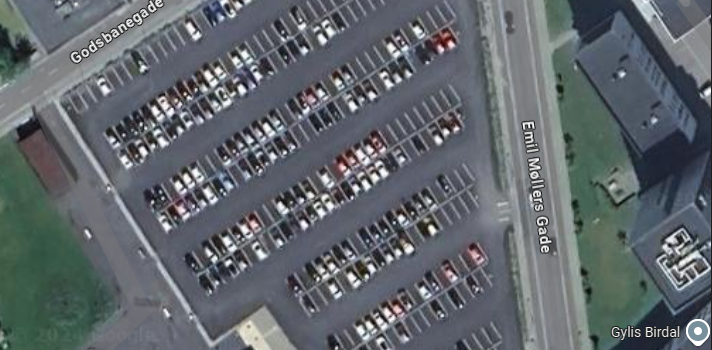
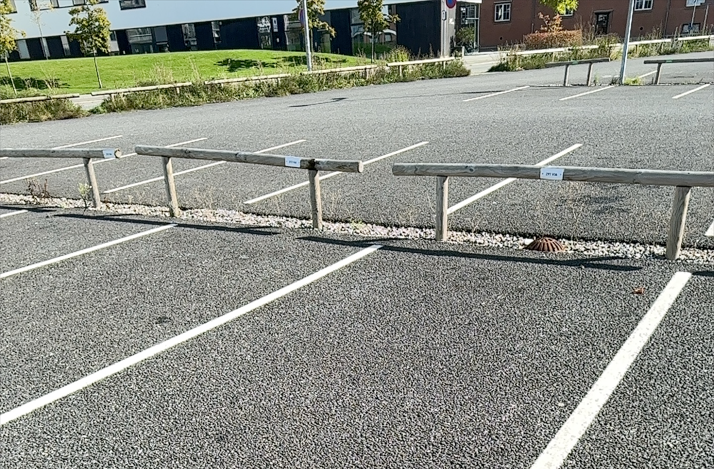
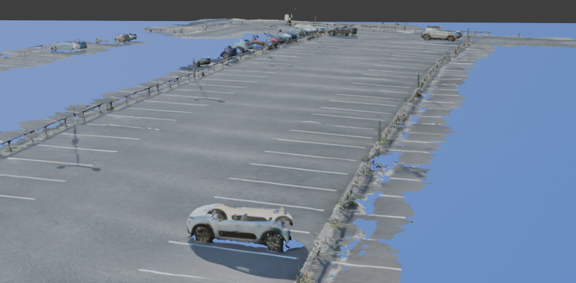
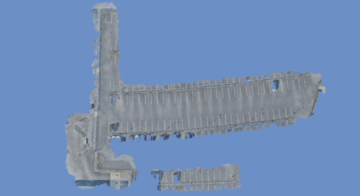

# AR Dev Blog Post 1
**Authors:** Simon Lassen, Sebastian Ørndrup

Welcome to our first XR dev blog post. This blog post covers the beginning of our AR project and the work we've done in the first lab week. Let's get started!

## The Idea: Find Your Car AR Mobile Application
Our group came up with the idea of creating an AR mobile application that can help you find your car in the parking lot.
When a user of the app has parked their car, they type in the number of the parking spot in the app and leave.
When they come back to the parking lot later, they can bring out their phone and point the camera around the parking lot.
The app will then guide the user in the direction of their car.
We have chosen to focus on the VIA parking lot for our project.

## The approach
/* Write about the process/methods/technologies we're intending to use to create the app. */

/* Write about the idea of overlaying a 3D model of the parking lot into the real world. */
In our AR project, the idea of overlaying a 3D model of the parking lot into the real world serves as the foundation for providing a seamless and intuitive user experience. By integrating a virtual 3D model of the VIA parking lot into the real-world environment through augmented reality, users can visualize the parking layout directly on their device. The digital overlay will enhance awareness and make it easier for users to navigate.

When the user opens the app and points their phone's camera at the "Scanningpoint", the 3D model will align with the real parking lot. The overlay will help the user orient themselves in real time, as the virtual path to their car can be dynamically displayed. This approach reduces the complexity of playing lot navigation by visually guiding the user with augmented arrows or markers pointing towards their car, creating an interactive map that blends with reality.

## Creating a 3D Model of the VIA Parking Lot
The focus of our first lab week was to get started on creating a 3D model of the VIA parking lot.
We thought a combination of using images from Google Maps and scanning the parking lot with a 3D scanner app would be a good approach.
Getting the Google maps images didn't take too long.

Next step was to scan the parking lot with a 3D scanner app.
Our supervisor recommended that we performed the 3D scan on a phone that supports the LiDAR technology for the best results.
None of our phones supported that, but we we're able to borrow an iPhone 14 Pro for the week.
We performed the 3D scans of the parking lot over the weekend to avoid too many cars being present on the 3D model.

Multiple scans were performed across different areas of the parking lot. The scans were then exported as .fbx files and imported into Blender. Here's an example of what that looks like inside Blender:

Below is an illustration of all the areas of the parking lot that we scanned.
It's a combination of all our 3D scans combined into a single 3D model which gives a great overview over the areas that we scanned.

