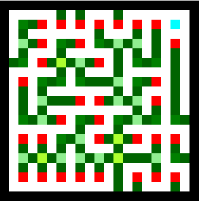

# VR Dev Blog Post 1
**Authors**: Sebastian Ørndrup, Anders Hellesøe

### Overview
The core of our project is a **VR Maze Game** where the player must escape from a twisting, complex labyrinth. But there's a catch - the player isn't alone. Inspired by the terrifying *Warden* character from *Minecraft*, a relentless creature roams the maze, determined to hunt down the player. The player's mission is simple yet challenging: **avoid the Warden and find the way out before being caught**.

### Game Mechanics
The game emphasizes **survival, exploration, and strategy**. Players must move carefully, as the Warden is sensitive and will hunt based on the player's movements. Players can expect:
- **Puzzle-Like Navigation**: The maze is designed to disorient and challenge, requiring players to think and strategize their escape route.
- **Immersive VR Experience**: Built in VR to enhance realism, providing players with a truly heart-pounding journey through the maze.

### Inspiration: The Warden from Minecraft
The Warden, a terrifying creature from Minecraft, serves as the central antagonist in our VR game. Known for its impressive sensory abilities, the Warden reacts to player movements, making it a perfect fit for VR horror elements. We aim to capture the suspense and thrill that Minecraft players feel when encountering the Warden, translating it into a VR setting where the player’s physical movements and reactions intensify the gameplay experience.

## Maze Algorithms
Maze generation is a fairly common question, that has been explored using graph theory and a fair amount of even simpler algorithms. We could also design our own maze by hand, but implementing a algorithm would also allow us to create procedural generated mazed, to give the game more "replay-ability." So that left the question of what algorithm we wanted to use. We went through [Professor I' "Maze Generation Algorithms - An Exploration"](https://professor-l.github.io/mazes/) to look at what outputs would best fit our use-case.
We considered a few different criteria for what we felt would make good mazes during VR exploration. We wanted the algorithm to generate mazes such that:
- Dead ends would not be found at the end of very long winding corridors with few branches
- The paths generated should not be limited to just being strait (as in they should have zigzag diagonals)
- That the maze often would has a more or less uniform complexity
- Whether the algorithm could create wall islands would be irrelevant

Other then this, speed was thought about, but will likely matter very little, for the size of the mazes we will be generating.

Through these criteria, maybe a few others, and a gut feeling we picked "Wilson's algorithm". Funnily this algorithm can generate some called a "Uniform Spanning tree," which more or less means that it is equally likely for it to generate any maze one could think up.

### Maze Meta Data

Our maze generation algorithm leaves us with a with a boolean wall or no wall maze. We would like to have information about the how walls or paths interact with each other. You might be able to generate this data while constructing the maze, but an easier method is to just scan the entire maze afterwards.

```cs
private static string MetaType(int[][] window) {
    if (window[1][1] == 0) {
        return "mp";
    }
    /* type vals
        * x 1 x
        * 2 x 8
        * x 4 x
        */
    int typeVal = 0;
    if (window[0][1] == 1) { typeVal += 1; }
    if (window[1][0] == 1) { typeVal += 2; }
    if (window[2][1] == 1) { typeVal += 4; }
    if (window[1][2] == 1) { typeVal += 8; }

    return typeVal switch {
        0 => "ow",
        1 => "nn",
        2 => "ww",
        4 => "ss",
        8 => "ee",
        3 => "nw",
        5 => "ns",
        6 => "ws",
        10 => "we",
        12 => "se",
        9 => "en",
        7 => "tw",
        11 => "tn",
        13 => "te",
        14 => "ts",
        15 => "xw",
        _ => throw new Exception("should never happen")
    };
}
```

When scanning through the maze a 3 by 3 window is given to this function that sums whether there is another wall in each of the cardinal directions, and then the designated data is returned, corresponding to the windows shape.

For testing a string is output, but the implemented version outputs a struct containing the data in a format that is easier for other processes to work with. 

During testing the values could be used to create something akin to a heat map.



This map then could allow us to check that the different types are identified as expected. In this map it red pixels are end walls, dark green are strait walls, cyan is a wall that is unconnected to other walls, and so on.

The version used in the game, can be used to place different objects depending on the classification. It will also scan the paths which can be used to randomly place different types of points of interest in appropriate hallways, like dead ends or straightaways.
