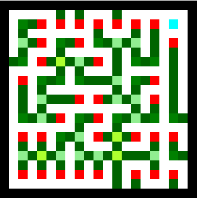

# VR Dev Blog Post 1
**Authors**: Anders Hellesøe

### Maze meta data

Our maze generation algorithm leaves us with a with a boolean wall or no wall maze. We would like to have information about the how walls or paths interact with each other. You might be able to generate this data while constructing the maze, but an easier method is to just scan the entire maze afterwards.

```cs
private static string MetaType(int[][] window) {
    if (window[1][1] == 0) {
        return "mp";
    }
    /* type vals
        * x 1 x
        * 2 x 8
        * x 4 x
        */
    int typeVal = 0;
    if (window[0][1] == 1) { typeVal += 1; }
    if (window[1][0] == 1) { typeVal += 2; }
    if (window[2][1] == 1) { typeVal += 4; }
    if (window[1][2] == 1) { typeVal += 8; }

    return typeVal switch {
        0 => "ow",
        1 => "nn",
        2 => "ww",
        4 => "ss",
        8 => "ee",
        3 => "nw",
        5 => "ns",
        6 => "ws",
        10 => "we",
        12 => "se",
        9 => "en",
        7 => "tw",
        11 => "tn",
        13 => "te",
        14 => "ts",
        15 => "xw",
        _ => throw new Exception("should never happen")
    };
}
```

When scanning through the maze a 3 by 3 window is given to this function that sums whether there is another wall in each of the cardinal directions, and then the designated data is returned, corresponding to the windows shape.

For testing a string is output, but the implemented version outputs a struct containing the data in a format that is easier for other processes to work with. 

During testing the values could be used to create something akin to a heat map.



This map then could allow us to check that the different types are identified as expected. In this map it red pixels are end walls, dark green are strait walls, cyan is a wall that is unconnected to other walls, and so on.

The version used in the game, can be used to place different objects depending on the classification. It will also scan the paths which can be used to randomly place different types of points of interest in appropriate hallways, like dead ends or straightaways.

### Warden AI

In Minecraft the main gimmick of the Warden is that it's meant to be something that you slowly sneak around and avoid conflict with. As such a faithful version would be blind and then have it use sound and try and sniff where the player is once it gets closer, before attacking the player.

So the 2 most important thing initially is for the Warden to even be able to pathfind around in the maze, and then maybe to listen for sounds.

So pathing, we are a bit lucky that we have a grid based maze, and while graph structure doesn't matter a great deal for pathing algorithms, they are very easy to set up for grids. Our team has had previous experience with the A* algorithm, and therefor already had an implementation designed for use in grid based graphs. It was however designed for waited graphs and not boolean mazes. We instead modified the algorithm to consider walls as having an extreme weight and paths having a weight of 1. This allows the Warden to walk through a wall but only of no other reasonable path can be found.