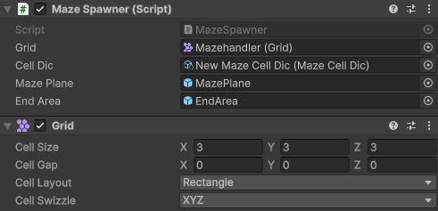
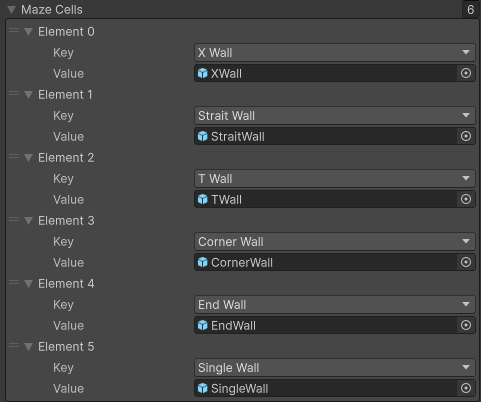
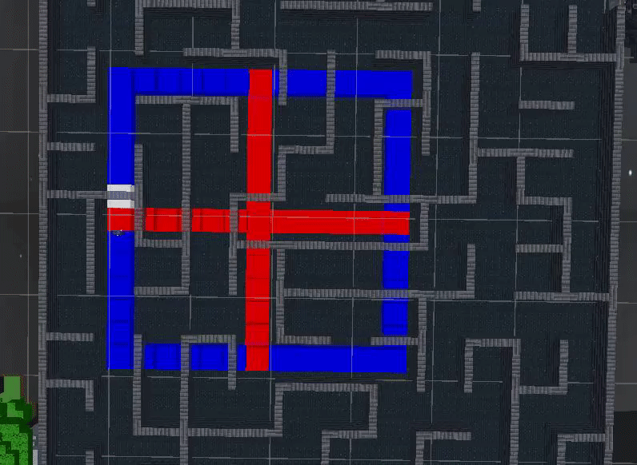
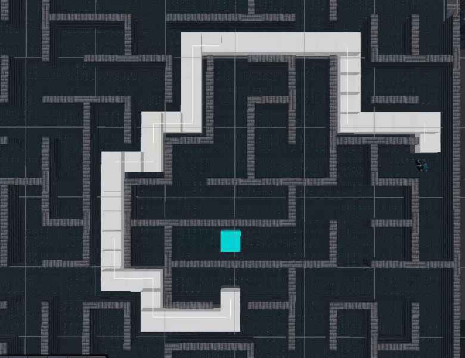

# VR Dev Blog Post 2
**Authors**: Anders Hellesøe

## Instantiating the maze in Unity

With the Meta maze that was described in previous blog post, methods for actually instantiating the maze in unity, can be created. The method we use for this is to define a grid using the `Grid` component, and then place prefabs following to maze data. This same script will then also ensure the size of the floor and the placement of the completion area.

In the above image a field called "Cell Dic" can be seen. This field is a reference to a `ScriptableObject` that holds a dictionary prefabs keyed on their "Meta identifier," corresponding to a type of Maze cell as categorized in the "Meta Maze." The dictionary is only responsible for cell types, cell orientation is specified separately in the "Meta Maze."

The dictionary seen in this image shows 6 wall types, but we had ideas to potential create alternate walls of each types, and maybe have several different path cell types as well.

## Warden AI

In Minecraft the main gimmick of the Warden is that it's meant to be something that you slowly sneak around and avoid conflict with. As such a faithful version would be blind and then have it use sound and try and sniff where the player is once it gets closer, before attacking the player.

So the main pieces of the Wardens AI to even be able to pathfind around in the maze, and to listen for where sounds occur.

### Wandering

So pathing, we are a bit lucky that we have a grid based maze, and while graph structure doesn't matter a great deal for pathing algorithms, they are very easy to set up for grids. Our team has had previous experience with the A* algorithm, and therefor already had an implementation designed for use in grid based graphs. It was however designed for waited graphs and not boolean mazes. We instead modified the algorithm to consider walls as having an extreme weight and paths having a weight of 1. This allows the Warden to walk through a wall but only of no other reasonable path can be found.

When the Warden path finds it will select a psudo random gridcell and use the above mentioned algorithm to generate a path to this square, this path is just a list of gridcell and not specific world coordinates. The Warden will then update it's position and rotation towards the next checkpoint. A new checkpoint is gotten chosen a set length before reaching the previous checkpoint, this smooths out the pathing quite a bit, as it allows the Warden to cut corners.

In the above GIF a window, marked in blue centered on the red cross, can be seen. A pathing goal is picked at random inside this window, in order to have to Warden pick random paths that have a higher chance of intersecting the player. This makes it less likely that the Warden just pathfinds in corder far away and never encounters the player, which can be a real problem for mazes with larger dimensions.

### Searching for sound event sources

In Minecraft the Warden is blind and follows vibrations, this idea works great for a way to interact with the Warden. For this project the Warden will prioritize pathing towards the newest sound event, over any path pick during wandering. It is important to note that sound events are not directly correlated to playing any audio, but is just a custom event system. 

When a sound event is fired the Warden will stop wandering and start running to the gridcell nearest to the event coordinate, that doesn't contain a wall, as illustrated with the above GIF. This is used for a system that allows luring the Warden in a direction that is advantageous to the player. The Warden will then go back to wandering once a sound event source is reached.

### Attacking a player

To have the warden be aggressive towards the player, there was a few strategies we considered. One idea was to have the player fire sound events at random, one was to create special areas in which the player would fire sound events, and another was a run feature that would make sound. The idea we in the end ran with, was to have to Warden attack the player, if the player stays within direct line of sight for a small duration.

The Warden will then charge the player while the player stays with a certain range and within line of sight. If the player hides behind a corner or gets far enough away, then the warden will return to Wandering. The idea is to have the Warden be quite aggressive, but to only have it know your last position. It is also meant to insinuate that the Warden perhaps heard or smelled you, but that it didn't see you.