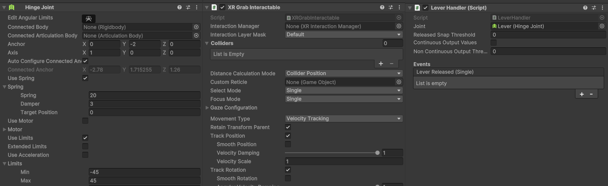

# VR Dev Blog Post 3
**Authors**: Simon Lassen, Sebastian Ørndrup

## Creating Interactable Game Objects
One of the key elements to make the VR game more immersive is to have objects within the game that the player can physically interact with.
Our idea was to port some of the interactables from Minecraft into our VR game. Below are the interactables from Minecraft that we ported into our game.

### A Wooden Button
In the starting area of the game, there are certain settings that the player can change regarding the maze generation.
To change these settings, we decided to roll with a simple recreation of Minecraft buttons. We created a 3D model of the button and imported it into Unity. To create the press-functionality, we attached the `XR Simple Interactable` component from the XR Interaction Toolkit and a custom script of our own:

The `XR Simple Interactable` script fires and event when a player presses and releases the "grab" button on their controller while their hand is placed on the button. These events are handled by our custom `Button Handler`. The `Button Handler` moves the button in and out. It also invokes any function that has been subscribed to it from the Unity editor, when the button is pressed.

Here is what the button looks like in-game:

### A Lever
When the player is ready to start the game, a gate has to be opened. To open this gate, we recreated the lever from Minecraft.
In Minecraft, a lever is activated by simply clicking on it. For our game, we wanted to utilize the VR environment.
Instead of simply clicking the button, the player will have to grab it and pull it down similarly to how a real lever works.
To achieve this, the following Unity components:

The `XR Grab Interactable` makes it possible to grab and pick up the lever handle. To prevent the player from running away with our lever handle, we use the `Hinge Joint` component. This component attaches the lever handle to the lever base. The Limits of the hinge has been configured to a range from -45deg to 45deg, which practically means the lever handle can point diagonally up and diagonally down. Lastly, we have our own custom `Lever Handler`. Custom functions can be subscribed to the `Lever Handler` in the Unity editor. The script will then invoke these functions if the lever is released after pulling it down.

Here is what the lever looks like in game:

### Snowballs
When the player is walking around inside the maze, snowballs can be thrown to distract the Warden.
A custom snowball 3D model was created in Minecraft-like style and imported into Unity.

A custom `Snow Ball Handler` script listens for button inputs on both controllers. Pressing and holding the trigger button of either the left or right controller will spawn a snowball prefab in the Player's hand. The `Snow Ball Handler` programmatically activates the `SelectEnter` and `SelectExit` events of the snowball prefab's `XR Grab Interactable` to attach and release the snowball from the player's hand.

The snowball prefab has a custom `SnowBall` script. This simple script fires a sound event (described in [VR Dev Blog Post 2](../VR%20Dev%20Blog%20Post%202/README.md)) which the Warden reacts to. The Warden will walk towards the position where the snowball landed.

Here is what throwing snowballs looks like in the game:

## More Immersion with Sound
Sound is also an important aspect when it comes to immersion. The following sounds were added to the game:
- Footsteps sounds that plays when the player is walking around
- Heartbeat noises that plays when the player is close to the Warden. A custom `Heart Beat Player` script makes this more immersive by increasing the volume and speed of the heartbeats depending on how close the player is to the Warden.
- Various scary Warden sounds. The Warden's `Wander Controller` script plays sounds when the Warden changes path, when it detects a snowball has been thrown and when charging the player.

## Creating a Lobby and Ending area
We've created a lobby inspired by Minecraft's **Ancient City**, that serves as the player's starting point. The lobby was actually built within Minecraft, and exported to an obj files using a tool called [Mineways](https://www.realtimerendering.com/erich/minecraft/public/mineways/index.html). Once complete, the build was imported into Blender for refinement. Finally, the model was imported into Unity via a FBX file. Similarly, an ending area at the end of the maze was created. The result is a visually striking and atmospheric that adds to the VR experience. The Lobby and ending area can be seen below:

## The Finished Result
That's all we were able to cover in these blog posts. To see the game in action, [check out this video demonstration.](https://youtu.be/rRTMI75DmDo)